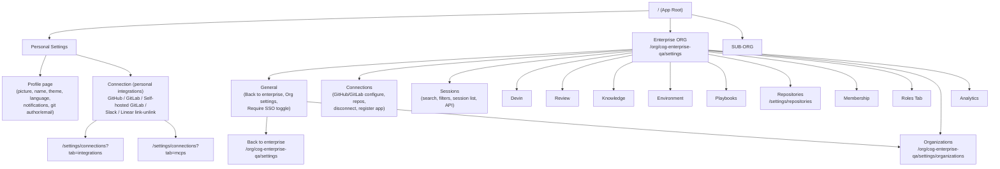

# ENT QA — Navigation Graph

Base host: `https://cog-enterprise-qa.beta.devinenterprise.com`

## 1. Notion guide structure (docs hierarchy)

```
ENT QA New Guide (index)
├── Personal
│   ├── Profile page
│   └── Connection
├── Enterprise ORG
│   ├── General
│   ├── Connections
│   ├── Sessions
│   ├── Devin
│   ├── Review
│   ├── Knowledge
│   ├── Environment
│   ├── Playbooks
│   ├── Repositories
│   ├── Membership
│   ├── Roles Tab
│   ├── Organizations
│   └── Analytics
└── SUB-ORG
```

## 2. Application route / navigation graph (Mermaid)



## 3. Known concrete routes (from test cases)

| Area | Route |
|------|-------|
| Enterprise settings root | `/org/cog-enterprise-qa/settings` |
| Organization settings | `/org/cog-enterprise-qa/settings/organizations` |
| Connections – integrations | `/org/cog-enterprise-qa/settings/connections?tab=integrations` |
| Connections – MCPs | `/org/cog-enterprise-qa/settings/connections?tab=mcps` |
| Repository permissions | `/settings/repositories` |

## 4. Sub-org navigation (observed R6, 2026-07-07)

Sub-org: display "jeet-test-org", slug `jeet-devin-qa`. Display-name routes (`/org/jeet-test-org/*`) 404.

```
Org-selector (/org/cog-enterprise-qa/org-selector)
└── jeet-test-org → /org/jeet-devin-qa/
    ├── New session      /org/jeet-devin-qa/            (home composer; Agent/Ask)
    ├── Automations      /org/jeet-devin-qa/automations (+ /automations/create)
    ├── Security         /org/jeet-devin-qa/code-scan   (Scans / Profiles tabs)
    ├── Review           /review                        (NOT org-scoped; PR view /review/<owner>/<repo>/pull/N)
    ├── Wiki             /org/jeet-devin-qa/wiki        (repo wiki /wiki/<owner>/<repo>?branch=<b>)
    └── Logo menu (jeet-test-org ▾)
        ├── Enterprise settings → /org/cog-enterprise-qa/settings
        ├── Invite members      → /settings/membership (enterprise scope)
        ├── Organizations list (switcher, + create, search)
        ├── Switch account
        └── Log out

Enterprise settings → Organizations → jeet-test-org → /org/jeet-devin-qa/settings
├── General            /org/jeet-devin-qa/settings
├── Connections        /settings/connections   (75 MCPs)
├── Products: Devin /settings/devin · DeepWiki /settings/deepwiki · Schedules /settings/schedules (legacy notice)
├── Resources: Knowledge /settings/knowledge · Environment /settings/environment · Playbooks /settings/playbooks · Skills & Rules /settings/skills · Secrets /settings/secrets
└── Administration: Repositories /settings/repositories · Membership /settings/membership (→ redirects to ENTERPRISE scope, BL-041) · Devin API /settings/devin-api · Analytics /settings/analytics (heading "Usage", BL-042) · Outpost pools /settings/outpost-pools (Beta)
```

Findings from this exploration: see `e2e_suborg.md` (E2E cases), `Bug.md` (BUG-015 new; BUG-001/006/011 re-verified), `coverage.md` AUTO-129..140.
